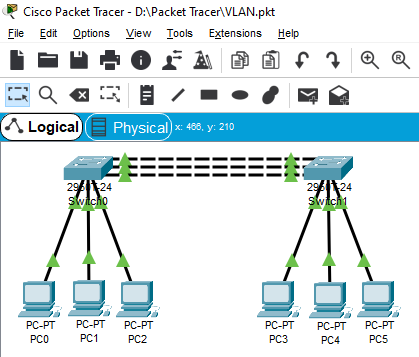

# Packet Tracer Configuration

## Switch 0

> Assign VLAN ID to interface ranges

```
S0(config)#interface range f0/1-f0/5
S0(config-if)#switchport access VLAN 100
S0(config)#interface range f0/6-f0/10
S0(config-if)#switchport access VLAN 200
S0(config)#interface range f0/11-f0/15
S0(config-if)#switchport access VLAN 300
```

## Switch 1

> Assign VLAN ID to interface ranges

```
S1(config)#interface range f0/1-f0/5
S1(config-if)#switchport access VLAN 100
S1(config)#interface range f0/6-f0/10
S1(config-if)#switchport access VLAN 200
S1(config)#interface range f0/11-f0/15
S1(config-if)#switchport access VLAN 300
```

---

## Finished Product

### Logical View

<p align="center">
  
</p>
